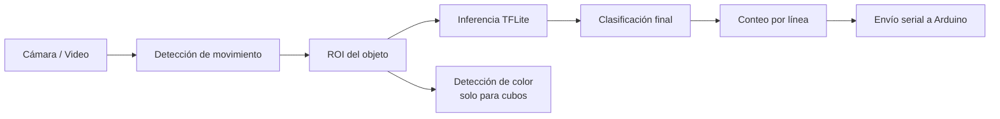

# DOCS

Este documento explica el proyecto de forma más clara y ordenada para que sea más fácil entender cómo funciona la banda clasificadora y cómo se conectan sus partes.

## 1. Objetivo del proyecto

El sistema detecta objetos que pasan por una cámara, intenta clasificarlos con un modelo de visión artificial y, cuando un objeto cruza una línea de conteo, registra la clase detectada y puede enviarla por puerto serial a un Arduino.

En términos sencillos, el proceso completo es este:

1. La cámara captura video en tiempo real.
2. El sistema detecta movimiento para encontrar el objeto.
3. Se recorta una región de interés (ROI) alrededor del objeto.
4. Esa ROI se manda al modelo para obtener una clase.
5. Si el objeto es un cubo, se detecta además su color.
6. Cuando el objeto cruza la línea de conteo, se incrementa el contador de esa clase.
7. Si Arduino está conectado, se envía el nombre de la clase detectada.

## 2. Vista general del flujo

## 3. Estructura principal del código

### `scripts/main.py`

Es el orquestador principal. Aquí se conectan todos los módulos:

- abre la cámara,
- crea los detectores,
- ejecuta el ciclo en tiempo real,
- dibuja la interfaz en pantalla,
- controla el conteo,
- manda la detección a Arduino.

### `src/vision.py`

Contiene `MotionDetector`.

Su trabajo es detectar el objeto que se está moviendo en el fondo de la escena. Usa un sustractor de fondo de OpenCV para encontrar regiones relevantes y devolver:

- si hubo movimiento,
- el bounding box del objeto,
- el centro del objeto.

Con esos datos también se obtiene la ROI, que es la región de interés: la cajita donde realmente está el objeto. Esa ROI es la que después se manda al modelo para clasificarla.

### `src/inference.py`

Contiene `ModelInference`.

Este módulo carga el modelo `model.tflite` y las etiquetas `labels.txt`. La idea aquí es sencilla: tomar la ROI que encontró la parte de visión y convertirla en una predicción útil.

Primero se prepara la imagen para el modelo, luego se redimensiona al tamaño esperado y finalmente se corre la inferencia. El resultado que devuelve es:

- nombre de la clase,
- nivel de confianza.

Si la confianza es alta, esa clase se toma como la clasificación del objeto.

### `src/color_detector.py`

Contiene `ColorDetector`.

Se usa solo cuando la clase base detectada es `cubo`. La razón es que el modelo principal distingue el objeto general, pero el color del cubo se resuelve aparte para tener una clasificación más específica.

Este módulo analiza la ROI en HSV y decide si el cubo es:

- rojo,
- verde,
- azul,
- desconocido.

HSV se usa porque normalmente ayuda más que RGB cuando se quiere separar colores de forma práctica.

### `src/counter.py`

Contiene `ItemCounter`.

Lleva el conteo por clase. Su lógica no cuenta el objeto por cada frame, sino únicamente cuando cruza una línea de conteo. Eso evita duplicados.

### `src/arduino_serial.py`

Contiene `ArduinoCommunicator`.

Maneja la comunicación serial con Arduino de forma no bloqueante. Si el programa detecta un objeto nuevo que ya fue contado, su clase se coloca en una cola y un hilo aparte intenta enviarla por serial.

## 4. Flujo de ejecución paso a paso

### 4.1 Inicio

Cuando se ejecuta `scripts/main.py`, primero se crean estos componentes:

- `ModelInference` para la clasificación,
- `MotionDetector` para localizar el objeto,
- `ColorDetector` para cubos,
- `ArduinoCommunicator` para el envío serial.

Después el programa pregunta dos cosas:

- orientación de la línea de conteo: `vertical` u `horizontal`,
- índice de cámara: normalmente `0`.

### 4.2 Lectura de frames

Dentro del ciclo principal se leen frames de la cámara. Si no se puede leer un frame, el programa termina.

### 4.3 Detección de movimiento

El módulo de visión busca la región más grande que parezca un objeto en movimiento. Si no hay movimiento, el sistema:

- reinicia el seguimiento del contador,
- muestra el mensaje “Esperando objeto...”.

### 4.4 Recorte de ROI e inferencia

Si sí hay movimiento, se extrae la ROI del objeto y se manda al modelo.

La salida normal es una clase como `jitomate_maduro`, `platano_inmaduro`, etc. Si la clase detectada es `cubo`, el sistema hace una segunda decisión usando color para refinarla a:

- `cubo_rojo`,
- `cubo_verde`,
- `cubo_azul`,
- `cubo_desconocido`.

Esta parte es clave porque el modelo no clasifica toda la escena, solo la porción donde realmente está el objeto.

### 4.5 Conteo

La clase final se envía al contador. El objeto solo se cuenta cuando su centro cruza la línea configurada.

Esto es importante porque un objeto puede permanecer varios frames en pantalla. El sistema evita sumar varias veces el mismo objeto usando:

- `already_counted`,
- distancia respecto a la línea,
- salto máximo permitido entre posiciones.

La idea es seguir la posición del centro del objeto en cada frame. Cuando ese centro pasa la línea, recién ahí se suma uno a la clase correspondiente.

### 4.6 Envío a Arduino

Cuando se detecta un nuevo conteo, el sistema llama a `send_detection(class_name)`.

Ese envío se hace en segundo plano para no congelar el video. El comunicador serial intenta conectarse automáticamente al puerto del Arduino o ESP32 si no se especifica un puerto manualmente.

## 5. Qué hace cada algoritmo

### Detección de movimiento

Se usa como filtro previo al modelo. Su idea es simple:

- no analizar todo el frame,
- solo analizar lo que parece ser el objeto real,
- ahorrar tiempo de inferencia.

Esto mejora rendimiento y reduce ruido.

### Clasificación con TFLite

El modelo no “ve” toda la escena, solo la ROI. Eso ayuda a que la red se concentre en el objeto y no en el fondo.

### Detección de color

El módulo de color usa HSV porque ese espacio suele ser más estable para distinguir colores que RGB o BGR.

### Conteo por cruce de línea

La idea de la línea de conteo es muy común en bandas transportadoras:

- un objeto aparece,
- se sigue su centro,
- cuando cruza una referencia, se cuenta.

Eso permite una lógica más confiable que contar por presencia en pantalla.

## 6. Entrenamiento del modelo

El proyecto incluye el notebook `notebooks/model_train.ipynb` y la carpeta `dataset/`.

La estructura del dataset está organizada por clases. Eso sugiere que el modelo fue entrenado con carpetas por etiqueta, lo cual es común para clasificación supervisada.

Los archivos importantes del modelo son:

- `model/model.keras`: modelo guardado en formato Keras,
- `model/model.tflite`: versión optimizada para inferencia,
- `model/labels.txt`: lista de clases en el mismo orden que el modelo.

Si se cambia el modelo, hay que mantener consistencia entre:

- el archivo `.tflite`,
- las etiquetas,
- el postproceso en `scripts/main.py`.

El entrenamiento se hizo con TensorFlow y Keras. Como base se utilizó MobileNetV2, que es una red ya entrenada previamente y útil para clasificación de imágenes. La ventaja de usar una red base como esa es que no se empieza desde cero: se aprovechan patrones visuales que el modelo ya sabe reconocer.

Los datos de entrenamiento vienen de datasets abiertos de Kaggle organizados por clases. Esa estructura de carpetas permite entrenar de forma supervisada, donde cada carpeta representa una etiqueta concreta.

Después de entrenar el modelo en Keras, se exportó a TensorFlow Lite para poder hacer inferencia más rápido y con menor consumo de recursos en la aplicación final.

## 7. Parámetros que probablemente quieras ajustar

### Orientación de la línea

El sistema permite línea:

- vertical,
- horizontal.

Eso es útil si la banda se monta en otra dirección o si la cámara está colocada distinto.